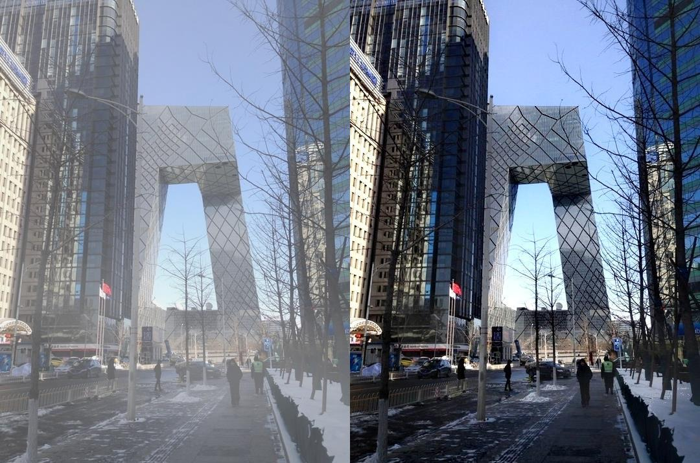
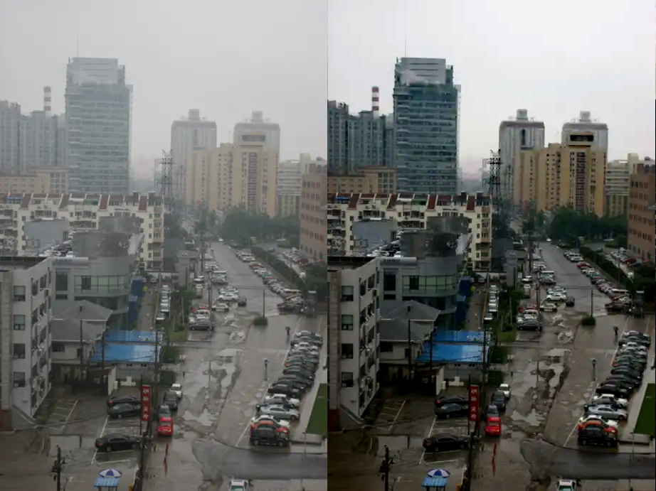

# 图像去雾处理系统使用教程

## 1. 安装依赖包

```bash
pip install -r requirements.txt
```

## 2. 启动应用

### 2.1 运行Flask应用
```bash
python app.py
```

### 2.2 访问Web界面
1. 打开浏览器
2. 访问 http://127.0.0.1:5000 或 http://localhost:5000

## 3.去雾处理效果







